# nextgenCrossWorkbench

**NextGenCrossDesign** — a point-and-click Shiny front-end for the
[`nextgenCrossDesign`](#the-backend) genomic cross-prediction and mate-allocation
engine. It turns a genomic-selection cross-design pipeline into a **guided,
one-screen-at-a-time workflow** (Data → Objective → Scoring → Filters →
Allocation → Outputs → Run → Results) over plain CSV inputs, with NDSU branding,
editable input tables, interactive modelling graphics, a cross-linked HTML
report, an automatic cross-number optimizer, robust (posterior) allocation, and
a full polyploid design workflow.

The backend runs in a *separate*, user-configured R process, so this front-end
installs and runs cleanly on its own.

**Authors**

- **Backend** (`nextgenCrossDesign`, the breeding-genetics engine): **Dr. Sikiru Atanda**
- **Front-end** (`nextgenCrossWorkbench`): **Dr. Sikiru Atanda** and **Mario Morales**

Developed at North Dakota State University (PulseSmartLab).

---

## Contents

- [Movies: the guided workflow](#movies-the-guided-workflow)
- [What it does](#what-it-does)
- [The guided view](#the-guided-view)
- [Install](#install)
- [Run](#run)
- [Guided walkthrough (with screenshots)](#guided-walkthrough)
- [Modelling graphics](#modelling-graphics)
- [Explore: linked figures](#explore-linked-figures)
- [Diagnostics & tuning](#diagnostics--tuning)
- [The interactive report](#the-interactive-report)
- [Polyploid / clonal design workflow](#polyploid--clonal-design-workflow)
- [Feature coverage](#feature-coverage)
- [Testing & robustness](#testing--robustness)
- [Scientific references](#scientific-references)
- [The backend](#the-backend)
- [Citation](#citation)

---

## Movies: the guided workflow

**Guided cross prediction, end to end** — load the bundled demo, then step
through the objective, scoring, filters and allocation with the progress
stepper, run, and land on the results and modelling graphics:


**Modelling graphics** — the Results screen walks through five interactive
`plotly` views of the predicted crosses one figure at a time, each with a short
explanation: the score distribution, a per-trait ridgeline, score × confidence
coloured by risk, score vs diversity, and per-trait cross-validation reliability:

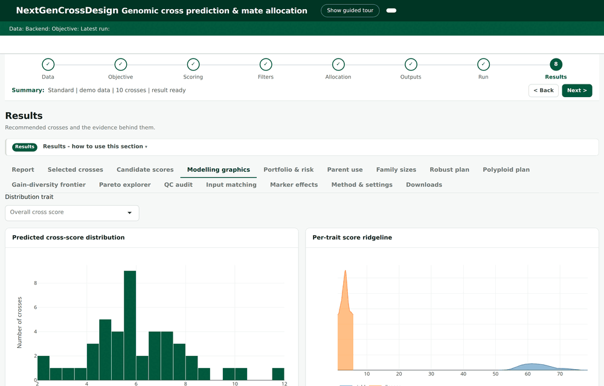

**Explore — one selection across four figures** — click a cross, a parent, or a
heatmap cell in any of the four linked figures; the other three dim to the same
selection and the tables below filter to it:

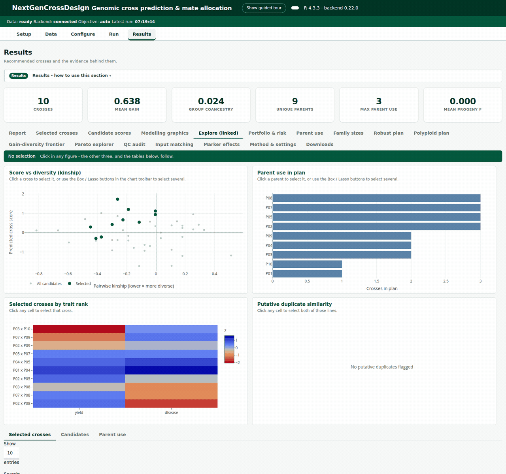

---

## What it does

The workbench predicts the genetic merit of every possible cross between a set of
genotyped, phenotyped parents, then allocates a mating plan that trades off
**genetic gain** against **diversity** (group coancestry / inbreeding). It
covers the whole decision, from raw CSVs to a shareable report:

- **Genomic cross prediction** — marker-effect estimation, per-cross progeny
  mean and variance, and the *usefulness criterion* (mean + selection intensity ×
  progeny standard deviation) as the default merit metric.
- **Flexible selection objective** — pick a **single trait**, **multiple traits**
  combined into a selection index, or **your own pre-computed index column**, with
  explicit direction-aware selection (yield up, disease down) and several
  combination methods (auto, weighted, economic index, desired gain). Optionally
  score each cross by its **joint probability of superior progeny** — the chance a
  cross yields offspring that clear the target on *all* traits at once.
- **Breeder decision controls** — a per-trait **check-line veto** (screen crosses
  against a reference line before allocation), a unified **mate-relatedness** dial,
  and a single-trait **portfolio & risk** view (genetic level × within-family
  upside × estimation risk) layered on the priority tiers.
- **Optimal mate allocation** — optimum-contribution-style selection that
  balances mean gain against group coancestry, with greedy/evolutionary/MIP
  optimizers and constraints on parent use, kinship, and group quotas.
- **Automatic cross-number optimizer** — instead of fixing the number of crosses,
  the app can sweep K and recommend a number using a diminishing-returns
  (elbow / kneedle), effective-population-size floor, or coancestry-budget rule.
- **Pareto / breeder explorer** — walk the full gain–diversity frontier and pick
  the plan that matches your appetite for gain versus long-term diversity, rather
  than committing to a single trade-off up front.
- **Family-size allocation** — split a fixed total-progeny budget across the
  selected crosses by merit, with per-family minimum and maximum sizes, so the
  best crosses get proportionally more seed.
- **Robust (posterior) allocation** — re-optimize using posterior quantiles or
  top-N probabilities so the plan is stable under prediction uncertainty.
- **Interactive modelling graphics** — a Results panel of five `plotly` views
  built from the run's own candidate and selected crosses (see
  [Modelling graphics](#modelling-graphics)).
- **Polyploid / clonal design** — dosage-aware workflows for **autopolyploids**
  (potato-like, tetrasomic) with ploidy-aware GRM, dominance/heterosis, double
  reduction, and ploidy-aware QC, plus a **disomic-subgenome (allopolyploid)**
  path whose within-family variance is recombination-aware and GRM is
  VanRaden/Yang, computed per subgenome.
- **A self-contained interactive report** — executive summary, KPIs, and
  interactive figures, cross-linked and saveable to PDF or standalone HTML.

Inputs are **plain CSVs** you can edit in-app (double-click a cell). Every screen
has a collapsible "how to use this step" guide, and a live status bar shows
whether the backend is connected.

---

## The guided view

By default the workbench presents its screens as a familiar set of tabs. Setting
one option turns the same screens into a **minimalist, guided flow** — one screen
at a time, in the order you actually work in — without moving, renaming, or
removing a single control:

```r
options(ngcd.wizard = TRUE)   # set before run_workbench()
run_workbench("~/cross-workbench")
```

The guided view adds:

- a **clickable progress stepper** — *Data → Objective → Scoring → Filters →
  Allocation → Outputs → Run → Results* — that drives both the top-level stages
  and the Configure sub-tabs, so one bar tracks the whole design;
- **Back / Next** navigation that walks the flow one screen at a time;
- a **live one-line run summary** (workflow, data source, traits, number of
  crosses, and run status) that updates as you configure;
- a **minimalist look** with the raw navbar hidden so the stepper is the single
  source of navigation.

Everything is opt-in and non-destructive: no input is moved or renamed, every
backend parameter keeps working, and with the option off the classic UI is
**byte-for-byte unchanged**. If you prefer the guided flow but want the tabs back,
keep them visible with `options(ngcd.wizard.hidenav = FALSE)`. A developer build
(`?dev=1` on the URL, or `developer_mode: true`) adds a leading **Setup** step for
verifying the backend connection.

All screenshots below are of the guided view on the bundled demo (10 inbred
parents, 12 markers, traits *yield* ↑ and *disease* ↓).

---

## Install

Two packages, installed independently — the front-end does **not** need the
backend in the same R library.

```r
# 1. the backend (compiles native code — needs Rtools/Xcode/build-essential)
#    Floor is nextgenCrossDesign >= 0.7.0 (required_backend_version in config.yml).
remotes::install_github("pulsesmartlab-innovations/nextgenCrossDesignR@v0.18.0")

#    …or from a local source tarball:
R CMD INSTALL nextgenCrossDesign_0.18.0.tar.gz

# 2. this front-end — from CRAN once published:
install.packages("nextgenCrossWorkbench", dependencies = TRUE)

#    …or from a local source tarball:
install.packages("nextgenCrossWorkbench_0.27.0.tar.gz",
                 repos = NULL, type = "source", dependencies = TRUE)
```

All front-end dependencies are declared in `Imports` and pulled automatically:
`shiny`, `bslib`, `DT`, `jsonlite`, `yaml`, `base64enc`, `plotly`, `parallel`,
plus base `utils`/`grDevices`/`graphics`/`stats`. If your R can't reach CRAN,
install the imports first:

```r
install.packages(c("shiny","bslib","DT","jsonlite","yaml","base64enc","plotly"))
```

The interactive report, modelling graphics and figures use `plotly` (a hard
dependency, so charts are interactive out of the box). Excel workbook export and
static PNG figure export are optional and live in `Suggests` (`openxlsx`,
`ggplot2`), because they run in the backend process; the app degrades gracefully
without them.

### Updating the backend

The workbench runs the backend out-of-process (see `SystemRequirements`), so the
backend is a **separately installed R package**, not an automatic dependency —
reinstalling the workbench does not refresh it. When the backend publishes a new
tagged release, refresh it with:

```r
Rscript tools/update-backend.R          # installs the version this workbench requires
Rscript tools/update-backend.R 0.18.0   # or a specific version
```

The script reads `required_backend_version` from `config.template.yml`, installs
the matching `vX.Y.Z` tag from
`pulsesmartlab-innovations/nextgenCrossDesignR`, and verifies the result. The
backend repo is private, so `install_github` needs a GitHub token with repo read
scope (`Sys.setenv(GITHUB_PAT = "ghp_…")`); to skip the token, install from a
built tarball instead:

```r
NGCD_BACKEND_TARBALL=/path/nextgenCrossDesign_0.18.0.tar.gz Rscript tools/update-backend.R
```

You rarely need to touch the app for a backend update: the workbench calls the
backend by name and filters run parameters against the installed backend's live
formals, so new or changed backend parameters are picked up on the next run once
the package is reinstalled. Bump `required_backend_version` (in `config.yml` /
`config.template.yml`) only when the workbench needs to *require* a newer backend
— the app then warns at startup if an older one is installed.

### Two ways to run it

- **Individual, on your own machine — no Docker.** Install the two R packages and
  call `run_workbench()`. The app runs in `local` mode by default: your runs are
  kept in an `ngcd-data` folder beside your working directory and persist across
  sessions (the most recent `keep_runs` are retained — default 20; set
  `keep_runs: 0` to keep every run). Docker is **not** involved and **not** needed.
- **Hosted for many users on a server — Docker.** Deploy the containerised app
  under ShinyProxy (one container per user). This is the only scenario that uses
  Docker. It runs in `server` mode: per-session, ephemeral run storage. See
  [`deploy/`](deploy/) for the Dockerfile, ShinyProxy config, and instructions.

The mode is controlled by `deployment_mode` (`local` / `server`, or the
`NGCD_DEPLOYMENT_MODE` env var). Individual users never set it — `local` is the
default; the container image sets `server`.

---

## Run

```r
library(nextgenCrossWorkbench)

# First time on a machine: create a working folder with a config.yml to edit
init_workbench_dir("~/cross-workbench")
#   -> edit ~/cross-workbench/config.yml: set rscript_path and package_library

options(ngcd.wizard = TRUE)           # opt in to the guided view (optional)
run_workbench("~/cross-workbench")    # opens the app in your browser
```

`config.yml` points the app at the R installation and library where
`nextgenCrossDesign` lives (it can be a different R than the one running the UI).
Any key can be overridden by an environment variable, e.g. `NGCD_RSCRIPT_PATH`.

### Developer mode

By default the app shows only the analysis workflow (Data → Results). The
**Setup** screen and the **Save / Load settings** profile tools are hidden so end
users aren't exposed to configuration plumbing. Turn them on while configuring a
machine by setting `developer_mode: true` in `config.yml`, appending `?dev=1` to
the app URL, or setting `NGCD_DEVELOPER_MODE=true`.

**Setup** *(developer-only, hidden in production)* confirms the app can reach your
R installation and the `nextgenCrossDesign` engine — green badges for Rscript, the
runner, the backend package and its version, plus an optional-capabilities panel
(lpSolve, AlphaSimR, openxlsx, …).


---

## Guided walkthrough

The stepper follows the order you actually work in: load and check your data,
configure the design in five sections, run it, then explore the plan.

### Data — load, check, and edit inputs

Load the bundled demo or upload your own CSVs (comma/semicolon/tab separated; a
UTF-8 byte-order mark from Excel is handled automatically). Column mapping is
auto-guessed and adjustable, data-alignment checks flag ID/marker mismatches, and
every input table is **editable in place** — double-click a cell to change it and
re-run. A **Data quality** panel holds duplicate-parent detection,
marker-missingness and MAF filters, optional LD pruning, and a
residual-heterozygosity audit that mirrors the backend's inbred model.

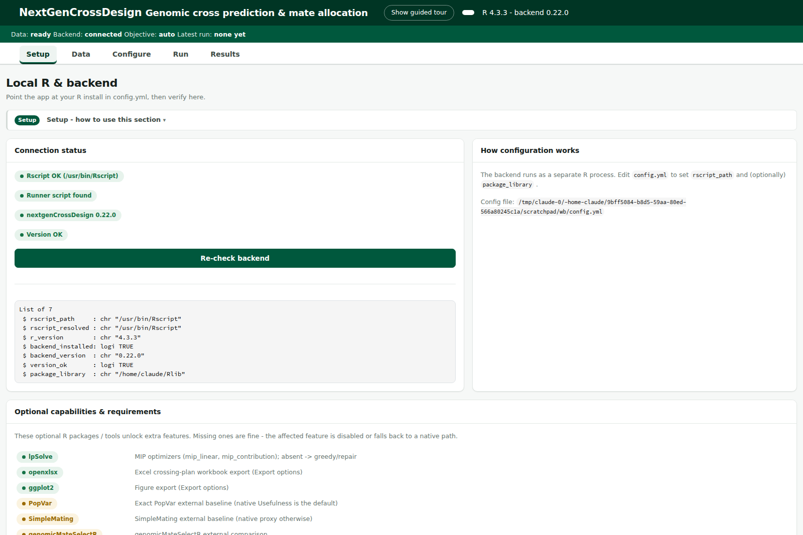

### Objective — what does *good* mean?

The breeder question as a three-way choice: a **single trait**, **multiple traits
(build a selection index)**, or **use my selection-index column** (a pre-computed
index already in your phenotype file). Single- and multiple-trait modes both run
full trait-by-trait prediction; for multiple traits you pick the combination
method (automatic, relative weights, economic weights, desired gains) and can add
a **joint P(superior progeny)** column. Trait directions are explicit, so risk
traits are selected *downward*.

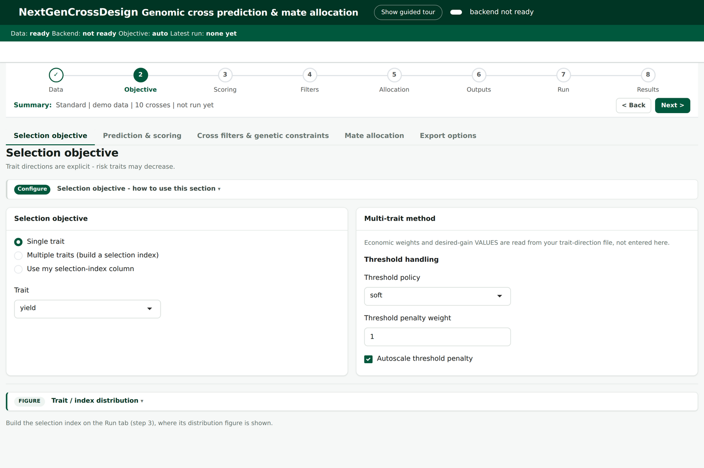

### Scoring — the prediction & variance model

The effect & variance model (recombination and GRM methods, marker-effect
reliability floor, optional training-set augmentation and posterior engine), the
**cross-value metric** (default the usefulness criterion), the breeding system
(DH or RIL) with the selection proportion, and the **parent type**
(*Inbred* / *DH* / *RIL*).

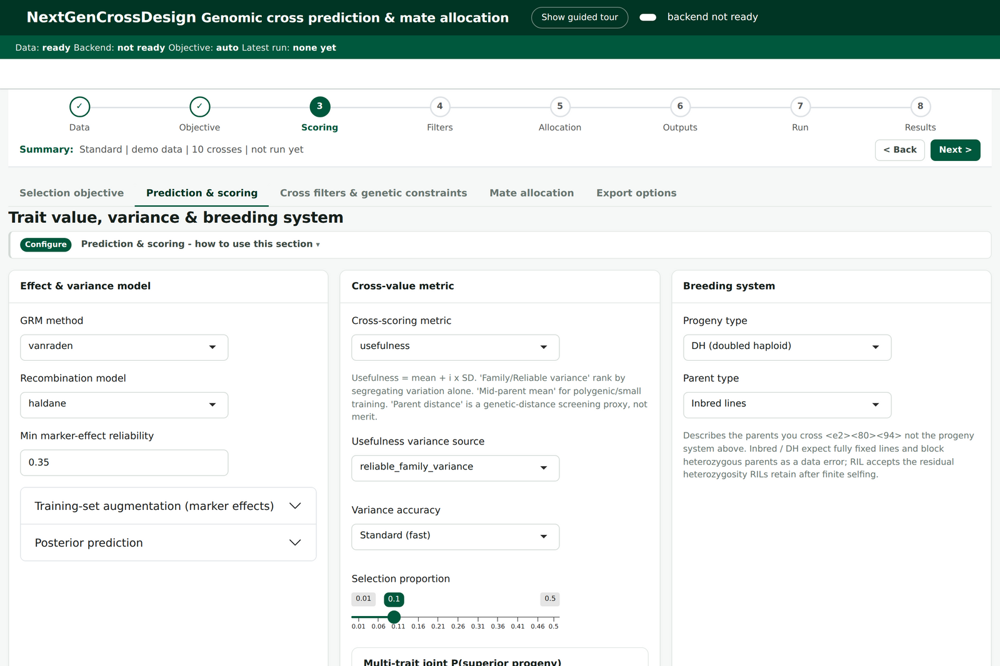

### Filters — cross filters & genetic constraints

Candidate-level screens applied *before* allocation: the **per-trait check-line
veto** (flag or remove crosses whose mid-parent for a trait is worse than a
reference line, on GEBV or phenotype basis), lethal-allele guarding, and
marker-target steering.

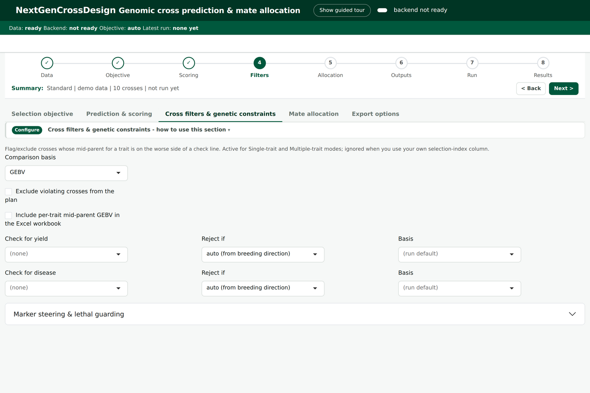

### Allocation — build the mating plan

The **number of crosses** (fixed, or let the automatic optimizer sweep K and
recommend a value), the gain-vs-coancestry dial, the unified **mate-relatedness**
control (avoid inbreeding / favor complementarity), the optimizer (greedy /
evolutionary / MIP / AlphaMate-style), constraints on parent use, kinship and
quotas, a family-size budget, the Pareto explorer, and a robust-allocation card
that re-optimizes on posterior quantiles for stability under uncertainty.

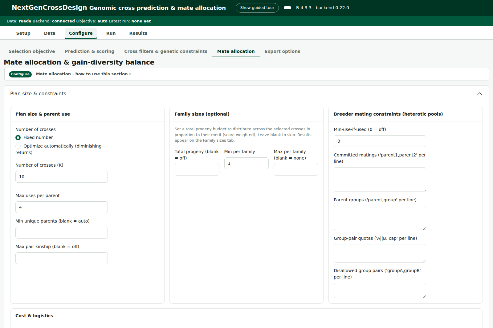

### Outputs — export options

Whether to write an Excel crossing-plan workbook (needs `openxlsx`) and static PNG
figures (needs `ggplot2`), and the random seed for reproducibility.

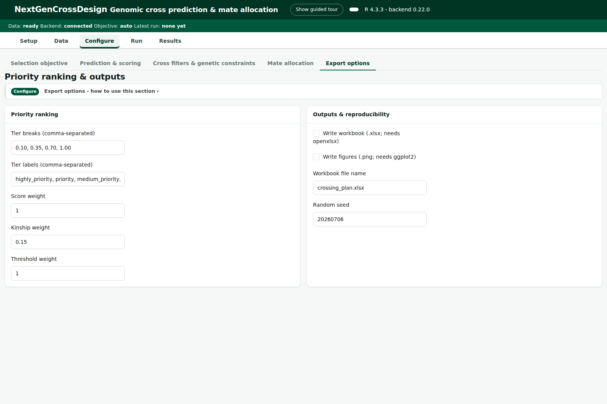

### Run — execute

The standard workflow runs as four explicit, **manually gated** steps rather than
one monolithic run: **Run QC → Fit effects & score → Build selection index →
Allocate & rank**. Each step's button unlocks only once its upstream step has
completed, each step's result is cached, and changing a setting marks only that
stage and the ones after it for a re-run. QC is a real gate — it blocks the design
only on *blockers* while warnings pass through. Each step assembles a JSON
configuration, materializes any edited tables, and drives the backend
out-of-process; errors are surfaced with plain-language hints.

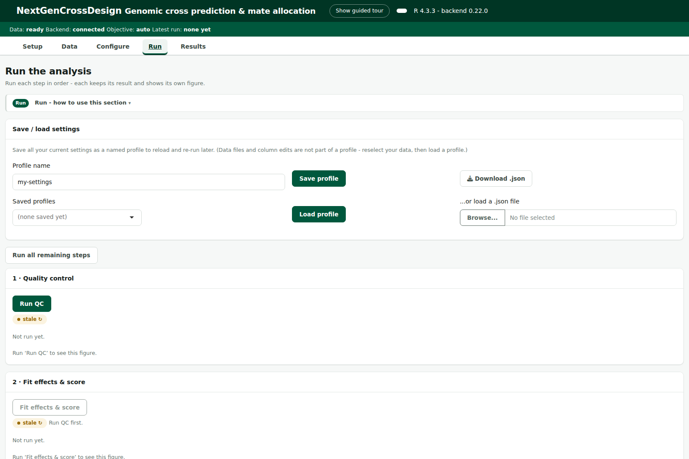

### Results — the plan and the evidence

A KPI row (crosses, mean gain, group coancestry, unique parents, max parent use,
mean progeny inbreeding) sits above sub-tabs for the ranked plan, candidate
scores, the **Modelling graphics** and the linked **Explore** view (both below),
parent use, family sizes, the
**Portfolio & risk** view, the gain-diversity frontier, the Pareto explorer, QC
audit, input matching, marker effects, and method/settings provenance — plus the
self-contained interactive report.

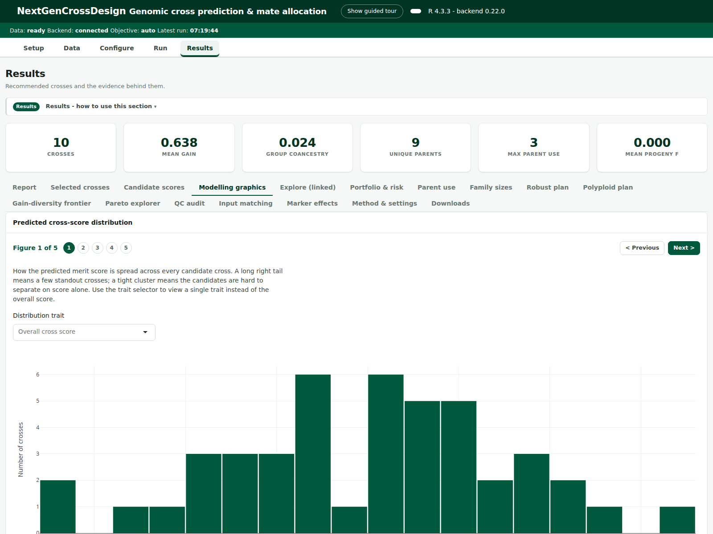

---

## Modelling graphics

The **Modelling graphics** sub-tab on the Results screen presents five interactive
`plotly` views built from the run's own candidate and selected crosses. Rather
than crowding them onto one board, it walks you through them **one figure at a
time** — each with a short plain-language explanation, and **Previous / Next**
navigation plus clickable step dots — mirroring how the run report presents its
figures. All five are empty-safe before a run:

1. **Predicted cross-score distribution** — a histogram of the merit score across
   every candidate cross, with an optional per-trait view.
2. **Per-trait score ridgeline** — overlaid density curves, one per trait, so you
   can compare where each trait's predicted values sit.
3. **Score × confidence (by risk)** — selected crosses plotted by predicted score
   against cross confidence, coloured by estimation-risk bin.
4. **Score vs diversity (kinship)** — every candidate by score against pairwise
   kinship, with the selected plan highlighted, so the gain–diversity trade-off is
   visible at the cross level.
5. **Trait-model reliability (cross-validation)** — a per-trait bar of the
   model's **cross-validated predictive R²**, coloured by selection direction,
   showing which traits the model predicts most dependably. The scale is an R²,
   so it goes negative when a trait is predicted worse than its own mean — the
   clearest signal that a trait is adding noise rather than information.

The charts share a colourblind-safe NDSU palette and are hover-, zoom- and
pan-able. They read the result schema directly (`candidate_crosses` /
`selected_crosses` and `effect_summary`), so they always reflect the exact run on
screen.

---

## Explore: linked figures

The **Explore (linked)** sub-tab puts four figures on one screen and gives them a
single shared selection, so a question asked in one is answered in the others.

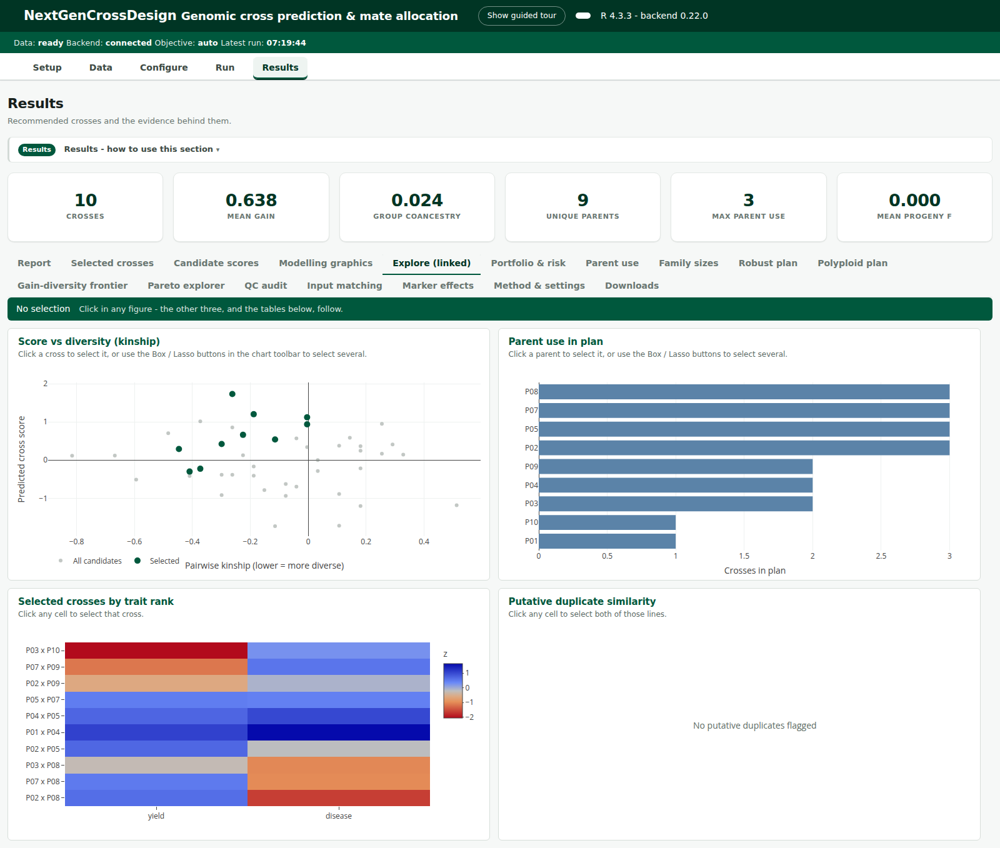

The four are not in the same unit of analysis, which is the point:

| Figure | One mark is | Gesture |
|--------|-------------|---------|
| Score vs diversity (kinship) | a **cross** | click, or Box / Lasso from the chart toolbar |
| Parent use in plan | a **parent line** | click, or Box / Lasso |
| Selected crosses by trait rank | a **cross** (one row) | click any cell |
| Putative duplicate similarity | a **parent line** (row/column) | click any cell |

So linking is a translation between the two, in both directions:

- pick **crosses** → those crosses stay lit, and so do the lines that parent them;
- pick **lines** → those lines stay lit, and so do the **plan** crosses that use
  them. Deliberately the plan and not every scored candidate: a commonly-used
  parent otherwise lights up most of the scatter, which is correct and unreadable.

Three rules keep it predictable:

1. **Selection always dims what is not selected** — the same visual language in
   every figure, never a highlight box in one and dimming in another.
2. **Three states are visibly distinct**: nothing selected (nothing dimmed);
   selected and matched here (the rest dimmed); selected but **nothing here
   matches** (everything dimmed). The third case matters — clicking a
   candidate-only cross leaves the plan-only figures with no match, and showing
   them undimmed would read as "the click did nothing".
3. **One clearing gesture** — the **Clear** button in the selection bar.
   Double-click keeps its usual plotly meaning of resetting zoom.

The tables underneath (selected crosses, candidates, parent use) filter to the
current selection, and the selection is session-only: it always starts empty and
a new run clears it.

Highlighting is applied in the browser rather than re-rendered from R, so it is
immediate and cannot fall out of step with what you clicked.

---

## Diagnostics & tuning

Every procedure — the automatic cross-number optimizer, mate allocation, robust
posterior re-optimization, trait reliability, and QC — can leave a plan looking
"off". A **Diagnostics & tuning** section in the interactive report — together
with inline run notes on the **Results** screen — explains *why* each procedure
produced its result and *which parameter to change* to steer it. Each item is
graded **CHECK** (act on it), **NOTE** (worth knowing), or **OK** (stable).

For example, the single most common reason an automatic cross-number
recommendation looks wrong is that it hit the edge of the swept range — the elbow
was never actually reached, so the number is capped by your range, not by the
data. The workbench detects this and tells you exactly what to do. Typical
diagnostics include a binding pairwise-kinship or parent-use cap, a trait with
very low marker-effect reliability dominating the score, how many candidate
crosses a **trait-check veto** flagged or removed, the mix of **portfolio
profiles** and estimation-risk bins in the plan, robust and point-estimate plans
disagreeing, and blocking QC issues. These are backed by the backend's
`constraint_diagnostics` and (single-trait) `priority_risk_diagnostics`.

---

## The interactive report

The **Report** tab renders a self-contained, cross-linked HTML report: an
executive summary in plain language, the KPI row, and interactive `plotly`
figures (priority tiers, multi-trait score distribution, selected-vs-all scatter,
gain-diversity frontier, cross-number diminishing-returns curve when the
auto-optimizer ran, parent use, trait-model reliability, and a trait-rank
heatmap). Charts are hover-, zoom-, and pan-able; the whole thing can be
downloaded as standalone HTML (plotly.js inlined, works offline) or PDF.

---

## Polyploid / clonal design workflow

Switching the analysis type to **Polyploid** on the Data screen exposes a
dosage-aware design path (`ng_polyploid_design_crosses`) for autopolyploids and
clonal crops: upload a dosage matrix (0..ploidy) and a single-trait phenotype, set
the ploidy, and optionally model dominance/heterosis, double reduction, and a
ploidy-aware GRM. The bundled demo is a tetraploid clone panel.

For **true allopolyploids** — species whose subgenomes are inherited *diploidly*
(each coded 0..2) — the **Disomic subgenome** analysis type runs everything
subgenome-aware: per-subgenome QC, marker effects, and VanRaden/Yang GRM, plus a
**recombination-aware** within-family usefulness variance (exact per-subgenome,
summed) when the marker map carries chromosome + cM positions. Autopolyploids such
as potato (dosages 0..4) use the *Polyploid* path instead — the subgenome path is
only for species whose subgenomes each segregate as a diploid. Both polyploid
paths run as the same **stepped, compute-once pipeline** on the Run screen as the
standard workflow, and are byte-identical to a one-shot run.

---

## Feature coverage

The front-end exposes the full parameter surface of the backend's cross-prediction
entry point and its optimization, robustness, and polyploid routines:

| Area | What's exposed |
|------|----------------|
| Selection objective | single trait / multiple traits (built into an index) / your own pre-computed index column; marker-effect reliability floor; posterior (MCMC) prediction |
| Merit | `var_complex` (usefulness), `uc`, `pmv`, `vpm`, `mean`, `var_simple`; UC variance source; PMV method |
| Multi-trait | auto / weighted / economic-index / desired-gain; soft/strict thresholds with autoscaled penalties; joint probability of superior progeny across all traits |
| Cross filters | per-trait check-line veto (GEBV/phenotype basis, flag or exclude); lethal-allele guarding; marker-target steering |
| Decision support | single-trait portfolio & risk profile (level × upside × estimation risk); `constraint_diagnostics` / `priority_risk_diagnostics` run notes |
| Modelling graphics | score distribution, per-trait ridgeline, score × confidence by risk, score vs diversity (kinship), per-trait cross-validation reliability |
| Explore (linked) | one selection shared across score-vs-kinship, parent use, trait-rank and duplicate-similarity figures, in both the cross and parent-line spaces; click or Box/Lasso; filters the result tables |
| Breeding system | DH / RIL (infinite or finite selfing); Haldane/Kosambi; VanRaden/Yang GRM |
| Allocation | OCS / greedy / evolutionary / MIP / AlphaMate-style; parent-use, kinship, quota constraints; unified mate-relatedness control |
| Cross number | fixed, or automatic sweep with elbow / kneedle / Ne-floor / coancestry-budget selection |
| Pareto explorer | walk the gain–diversity frontier and adopt any optimal plan along it |
| Family size | split a total-progeny budget across selected crosses by merit, with per-family min/max |
| Robustness | posterior-quantile and top-N-probability re-optimization |
| Polyploid | autopolyploid dosage 0..ploidy design (dominance/heterosis, double reduction, ploidy-aware GRM & QC); disomic-subgenome allopolyploid path with recombination-aware per-subgenome variance & VanRaden/Yang GRM |
| QC | duplicate detection, missingness/MAF filters, LD pruning, residual-heterozygosity audit |
| Output | interactive HTML + PDF report; Excel workbook; PNG figures; reproducible seed |

---

## Testing & robustness

The package ships an extensive `testthat` suite (Config/testthat/edition 3) and
passes `R CMD check` with **status OK** (no errors, warnings, or notes).

- **1,100+ assertions across the test suite.** Unit tests cover the IO/formatting
  helpers (delimiter and BOM auto-detection, quoted fields, Latin-1 fallback,
  number formatting, column guessing, the heterozygosity audit at diploid and
  tetraploid ploidy), the report layer (figure-registry integrity, applicability
  filtering, render-ready JSON serialization, self-contained interactive HTML,
  PDF, and graceful degradation on empty/sparse results), config and
  developer-mode gating, settings save/restore round-trips, run-directory and
  config-serialization edge cases, and error-hint mapping.
- **Guided-view and modelling-graphics tests** cover the progress stepper and its
  navigation math, the guided navigation layer and live run-summary, and the
  empty-safe `plotly` chart builders (`test-wizard-shell.R`, `test-ui-guided.R`,
  `test-ui-charts.R`).
- **Server-logic tests** drive the reactive layer with `shiny::testServer`,
  including regression tests for column-mapping crashes and wide-genotype ID
  selection.
- **Backend-gated integration tests** (run when `nextgenCrossDesign` is present)
  exercise real runs: the combination smoke sweep, the automatic cross-number
  sweep, robust posterior allocation, the residual-heterozygosity fix, and the
  full polyploid design.

Run the fast suite with:

```r
devtools::test()                     # non-backend tests
# or, including backend integration tests:
Sys.setenv(NOT_CRAN = "true", NGCD_RUN_COMBINATIONS = "1")
devtools::test()
```

Robustness hardening includes byte-safe CSV reading in any locale, byte-perfect
inlining of `plotly.js` (fixing blank charts under a C locale), a guarded `plotly`
JSON serializer with a `jsonlite` fallback, ASCII-only UI source (portable-package
clean), and display-safe report summaries that never surface a raw `NA`.

The guided view and modelling graphics are captured for these docs with a
self-contained recorder, [`tools/record-guided-demo.R`](tools/record-guided-demo.R),
which drives the real UI over a bundled demo result — regenerate the figures and
movies on your own machine (with the backend installed, for live results) from
there.

---

## Scientific references

The methods surfaced by this workbench draw on the following literature.

**Genomic prediction and relationship matrices**

- Meuwissen, T.H.E., Hayes, B.J., & Goddard, M.E. (2001). Prediction of total
  genetic value using genome-wide dense marker maps. *Genetics* 157(4):1819–1829.
- VanRaden, P.M. (2008). Efficient methods to compute genomic predictions.
  *Journal of Dairy Science* 91(11):4414–4423.
  [doi:10.3168/jds.2007-0980](https://doi.org/10.3168/jds.2007-0980)

**Cross usefulness and progeny-variance prediction**

- Schnell, F.W. & Utz, H.F. (1975). The usefulness criterion (F1 progeny mean +
  selection response) for evaluating crosses — the foundational concept, later
  formalized for genomic prediction.
- Lehermeier, C., Teyssèdre, S., & Schön, C.-C. (2017). Genetic gain increases by
  applying the usefulness criterion with improved variance prediction in
  selection of crosses. *Genetics* 207(4):1651–1661.
  [doi:10.1534/genetics.117.300403](https://doi.org/10.1534/genetics.117.300403)
- Wolfe, M.D., Chan, A.W., Kulakow, P., Rabbi, I., & Jannink, J.-L. (2021).
  Genomic mating in outbred species: predicting cross usefulness with additive
  and total genetic covariance matrices. *Genetics* 219(3):iyab122.
  [doi:10.1093/genetics/iyab122](https://doi.org/10.1093/genetics/iyab122)

**Optimal contribution selection & genomic mating**

- Meuwissen, T.H.E. (1997). Maximizing the response of selection with a
  predefined rate of inbreeding. *Journal of Animal Science* 75(4):934–940.
- Akdemir, D. & Sánchez, J.I. (2016). Efficient breeding by genomic mating.
  *Frontiers in Genetics* 7:210.
  [doi:10.3389/fgene.2016.00210](https://doi.org/10.3389/fgene.2016.00210)

**Polyploid relationship matrices & design**

- Amadeu, R.R., Cellon, C., Olmstead, J.W., Garcia, A.A.F., Resende, M.F.R., &
  Muñoz, P.R. (2016). AGHmatrix: R package to construct relationship matrices for
  autotetraploid and diploid species — a blueberry example. *The Plant Genome*
  9(3). [doi:10.3835/plantgenome2016.01.0009](https://doi.org/10.3835/plantgenome2016.01.0009)

**Mapping functions**

- Haldane, J.B.S. (1919). The combination of linkage values, and the calculation
  of distances between the loci of linked factors. *Journal of Genetics* 8:299–309.
- Kosambi, D.D. (1944). The estimation of map distances from recombination values.
  *Annals of Eugenics* 12:172–175.

**Related software**

- Peixoto, M.A., Coelho, I.F., Leach, K.A., Lübberstedt, T., Bhering, L.L., &
  Resende, M.F.R. (2025). SimpleMating: R-package for prediction and optimization
  of breeding crosses using genomic selection. *The Plant Genome*.
  [doi:10.1002/tpg2.20533](https://doi.org/10.1002/tpg2.20533)

---

## The backend

`nextgenCrossDesign`, authored by **Dr. Sikiru Atanda**, is the breeding-genetics
engine that performs marker-effect estimation, per-cross prediction, mate
allocation, the cross-number sweep, robust posterior optimization, and polyploid
design. This workbench is a thin, well-tested UI over that engine: it assembles a
JSON configuration, invokes the backend in its own R process, and renders the
results. Because the two are decoupled, the backend can be upgraded independently
and can live in a different R installation.

---

## Citation

If you use this workbench in published work, please cite both components:

> Atanda, S. *nextgenCrossDesign: genomic cross prediction and mate allocation*
> (R package). North Dakota State University.
>
> Atanda, S., and Morales, M. *nextgenCrossWorkbench: NextGenCrossDesign — a Shiny
> front-end for nextgenCrossDesign* (R package, v0.27.0). North Dakota State
> University, PulseSmartLab — PI: Dr. Sikiru Atanda.

---

*NextGenCrossDesign. Backend (nextgenCrossDesign): Dr. Sikiru Atanda.
Front-end (workbench): Dr. Sikiru Atanda and Mario Morales. North Dakota State
University, PulseSmartLab.*
